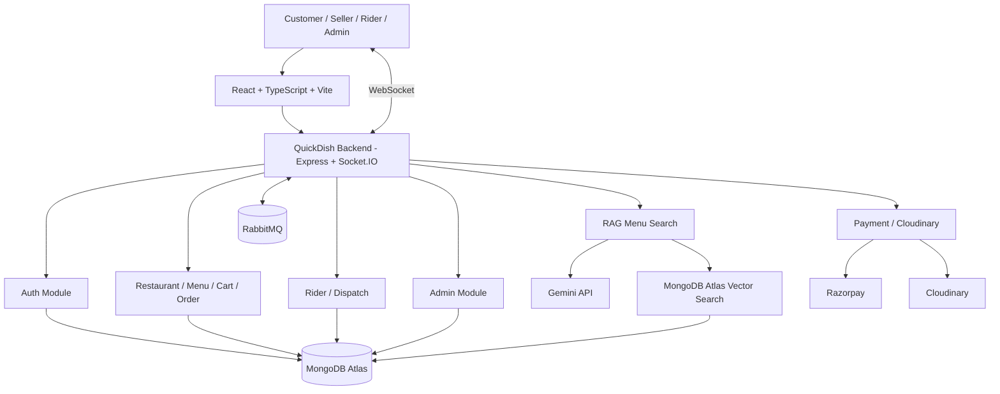
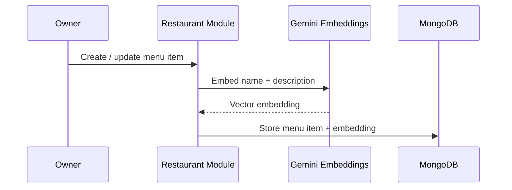
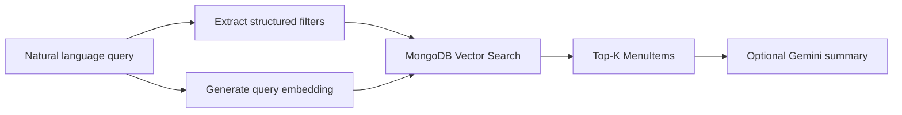
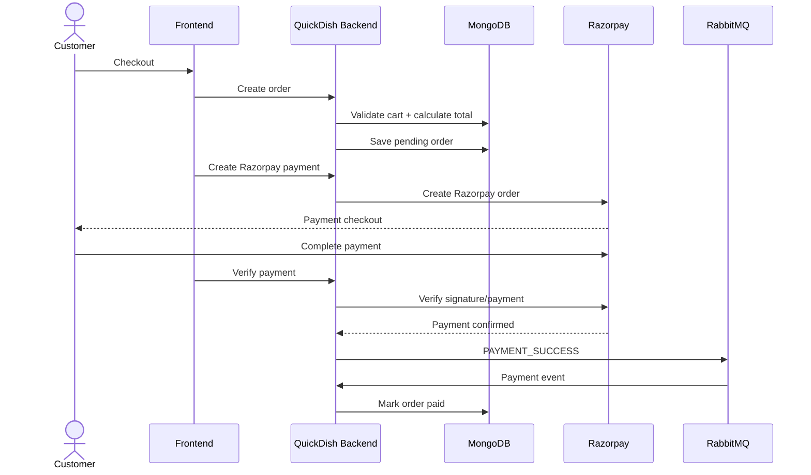

# 🍽️ QuickDish

### Full-Stack Food Delivery Platform · Modular Monolith · RAG-Based Menu Search

[](https://cravemate-client.onrender.com)


---

## 📌 Overview

**QuickDish** is a full-stack food delivery platform built with a **modular monolith architecture**.

It supports the complete food-delivery lifecycle:

**Customer → Restaurant → Payment → Order Processing → Rider Assignment → Real-Time Tracking**

The application combines REST APIs, RabbitMQ-based asynchronous workflows, Socket.IO real-time communication, MongoDB geospatial search, and a RAG-based semantic menu search system.

---

## ✨ Features

### 👤 Customer

- Google OAuth + Email/Password authentication
- Nearby restaurant discovery using geospatial queries
- Natural-language semantic menu search
- Menu, cart and address management
- Razorpay checkout with server-side verification
- Order history and real-time status updates
- Live rider location tracking

### 🏪 Restaurant Owner

- One seller account can own **multiple restaurants**
- Restaurants can exist at the same or different locations
- Each restaurant belongs to exactly one owner through `ownerId`
- Restaurant verification and open/close controls
- Menu CRUD and item availability management
- Paid-order processing and rider dispatch

### 🛵 Rider

- Rider onboarding and admin verification
- Online/offline availability
- Nearby delivery discovery
- Atomic order assignment
- Pickup and delivery workflow
- Real-time location updates

### 🛡️ Admin

- Restaurant verification
- Rider verification
- Protected admin APIs

---

## 🏗️ Architecture



The backend is organized into clear domain modules while running as a single deployable application:

```text
backend/
└── src/
    ├── auth/
    ├── restaurant/
    ├── rider/
    ├── admin/
    ├── realtime/
    ├── utils/
    └── shared/
```

---

## 🧠 RAG-Based Semantic Menu Search

QuickDish supports natural-language menu search such as:

```text
"spicy vegetarian under ₹200"
```

The system combines semantic retrieval with structured filters.

### Indexing Flow



### Query Flow



### Search Endpoint

```http
POST /api/menu/search
```

Example:

```json
{
  "query": "spicy vegetarian under ₹200",
  "limit": 10,
  "includeSummary": true
}
```

The search system can combine:

* Semantic similarity for intent such as `spicy` or `vegetarian`
* Price filters
* Availability filters
* Restaurant filters
* Top-K vector retrieval
* Optional LLM-generated result summary

If the embedding API fails, the endpoint falls back to keyword search instead of failing the request.

### Vector Storage

MongoDB Atlas Vector Search is used so menu documents, metadata, filters, and embeddings stay together.

The vector index contains:

```text
embedding      → vector
restaurantId   → filter
price          → filter
isAvailable    → filter
```

---

## 🔄 Order Flow

```text
Customer
   ↓
Cart
   ↓
Create pending order
   ↓
Razorpay checkout
   ↓
Server-side payment verification
   ↓
RabbitMQ PAYMENT_SUCCESS
   ↓
Order marked paid
   ↓
Restaurant notified via Socket.IO
   ↓
Restaurant accepts → prepares → marks ready
   ↓
RabbitMQ ORDER_READY_FOR_RIDER
   ↓
Nearby rider search
   ↓
Rider accepts delivery
   ↓
Live rider tracking
   ↓
Delivered
```

---

## 💳 Payment Flow

QuickDish uses **Razorpay** for online payments.



Payment amounts are calculated and verified on the backend rather than trusting client-provided totals.

---

## ⚡ Real-Time Features

Socket.IO handles:

* New restaurant order notifications
* Order status updates
* Rider assignment
* Delivery requests
* Live rider location updates

```text
Rider Browser
     ↓
Rider Module
     ↓
Socket.IO
     ↓
Customer
```

---

## 📍 Location-Based Features

MongoDB geospatial functionality powers:

### Restaurant Discovery

```text
Customer coordinates
        ↓
MongoDB geospatial query
        ↓
Nearby verified restaurants
```

### Rider Discovery

```text
Restaurant location
        ↓
MongoDB geospatial query
        ↓
Verified + available nearby riders
```

GeoJSON and `2dsphere` indexes are used for location-aware queries.

---

## 👥 Multiple Restaurants per Owner

A seller can own multiple restaurants:

```text
User A
 ├── Restaurant 1 — Jamshedpur
 ├── Restaurant 2 — Ranchi
 └── Restaurant 3 — Jamshedpur
```

Each restaurant has exactly one owner:

```text
Restaurant.ownerId → User._id
```

`ownerId` is immutable, and owner-based authorization is checked for restaurant operations.

---

## 🛠️ Tech Stack

| Technology                     | Purpose                                        |
| ------------------------------ | ----------------------------------------------- |
| React                          | Frontend UI                                    |
| TypeScript                     | Type safety and maintainability                |
| Vite                           | Frontend build tooling                         |
| Tailwind CSS                   | Styling                                        |
| Node.js                        | Backend runtime                                |
| Express.js                     | REST API layer                                 |
| MongoDB Atlas                  | Primary database                               |
| Mongoose                       | Data modeling and validation                   |
| MongoDB Vector Search          | Semantic menu retrieval                        |
| Gemini Embedding 2             | Menu and query embeddings                      |
| Gemini Flash                   | Optional result summarization                  |
| RabbitMQ                       | Asynchronous payment and rider-dispatch events |
| Socket.IO                      | Real-time communication                        |
| JWT                            | Authentication and authorization               |
| Google OAuth                   | Social authentication                          |
| bcrypt                         | Password hashing                               |
| Razorpay                       | Payment processing                             |
| Cloudinary                     | Image storage                                  |
| Leaflet / OpenStreetMap / OSRM | Maps and routing                               |
| Docker                         | Containerization                               |
| Render                         | Deployment                                     |

---

## 📂 Project Structure

```text
QuickDish/
├── frontend/
│
├── backend/
│   └── src/
│       ├── auth/
│       ├── restaurant/
│       │   ├── controllers/
│       │   ├── models/
│       │   ├── routes/
│       │   └── services/
│       ├── rider/
│       ├── admin/
│       ├── realtime/
│       ├── utils/
│       └── shared/
│
├── docker-compose.yml
└── README.md
```

---

## 🔐 Security

* JWT-based authentication
* Google OAuth
* bcrypt password hashing
* Role-based authorization
* Protected admin, seller and rider operations
* Server-side payment verification
* Internal service authorization
* Restaurant ownership validation
* Server-side order-state validation
* Environment-based secret management

---

## 🚀 Local Setup

### Backend

```bash
cd backend
npm install
# fill in your real values in backend/.env (gitignored, not committed) before running
npm run build
npm start
```

### Frontend

```bash
cd frontend
npm install
# fill in your real values in frontend/.env (gitignored, not committed) before running
npm run dev
```

### RAG Setup

Configure the following in `backend/.env`:

```env
GEMINI_API_KEY=your_key
GEMINI_EMBEDDING_MODEL=gemini-embedding-2
GEMINI_EMBEDDING_DIMENSIONS=768
GEMINI_SUMMARY_MODEL=gemini-3.8-flash
MENU_VECTOR_INDEX=menuItemVectorIndex
```

Then create the vector index and backfill existing menu embeddings:

```bash
cd backend
npm run create:menu-index
npm run backfill:menu-embeddings
```

---

## ☁️ Deployment

### Backend

```text
Root Directory: backend
Build Command: npm install && npm run build
Start Command: npm start
Health Check: /health
```

### Frontend

```text
Root Directory: frontend
Build Command: npm install && npm run build
Publish Directory: dist
```

---

## 🌐 Live Demo

### [🚀 Open QuickDish](https://cravemate-client.onrender.com)

> Free Render instances may take a short time to wake up after inactivity.

---

## 🎯 Key Engineering Highlights

* Modular monolith architecture with clear domain boundaries
* Event-driven workflows using RabbitMQ
* Real-time order and rider tracking using Socket.IO
* RAG-based natural-language menu search
* MongoDB Atlas Vector Search with structured pre-filters
* Geospatial restaurant and rider discovery
* Atomic rider assignment
* Secure Razorpay payment verification
* Google OAuth + Email/Password authentication
* Multiple restaurants per seller
* Cloudinary media management
* Dockerized deployment

---

<div align="center">

### 🍽️ QuickDish

**Discover food. Order fast. Track live.**

[Live Demo](https://cravemate-client.onrender.com)

</div>
